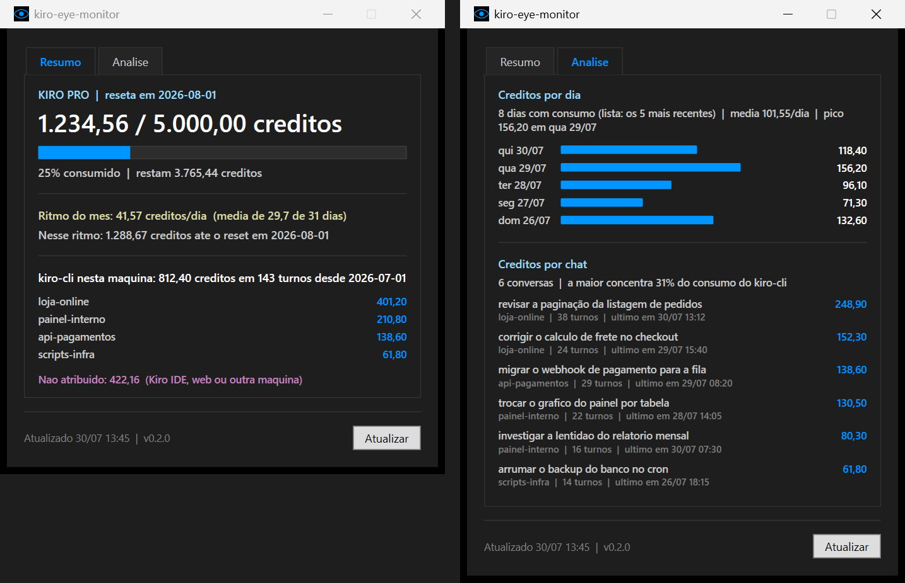

# kiro-eye-monitor

Janela no Windows que mostra quanto crédito Kiro você já consumiu no mês, lendo
os dados de dentro do WSL.



Os números da captura são de exemplo.

## Instalação

A instalação roda **obrigatoriamente dentro do WSL**, nunca pelo PowerShell. É
lá que os dados são lidos, e o PowerShell 5.1 trava ao executar scripts a partir
de `\\wsl.localhost`. Não existe versão equivalente do instalador para o Windows.

Abra o terminal do WSL e rode:

```bash
git clone https://github.com/4youseeProjetos/kiro-eye-monitor.git
cd kiro-eye-monitor
./install.sh
```

Se o seu terminal for o do Windows, entre no WSL no mesmo comando:

```powershell
wsl.exe -- bash -lc 'cd ~ && git clone https://github.com/4youseeProjetos/kiro-eye-monitor.git && cd kiro-eye-monitor && ./install.sh --desktop'
```

Clone dentro do WSL, como acima, e não em `/mnt/c`: funciona, mas a leitura dos
arquivos de sessão fica lenta pelo sistema de arquivos do Windows.

Se você já tem chave SSH na organização, pode usar:

```bash
git clone git@github.com:4youseeProjetos/kiro-eye-monitor.git
```

O script pergunta se você quer um atalho na área de trabalho, instala a janela em
`%LOCALAPPDATA%\KiroEyeMonitor` e já abre o app. Não precisa informar a distro nem
instalar nada além do que você já tem.

Opções, se preferir não responder à pergunta:

```bash
./install.sh --desktop      # cria o atalho sem perguntar
./install.sh --no-desktop   # não cria atalho
./install.sh --startup      # abre junto com o Windows
./install.sh -y             # aceita os padrões
```

### Instalação pelo próprio Kiro

Em vez de rodar os comandos à mão, você pode passar o repositório para o Kiro
resolver. No terminal do WSL, abra o `kiro-cli` e cole:

```
Instale o https://github.com/4youseeProjetos/kiro-eye-monitor na minha máquina
```

O repositório traz um [AGENTS.md](AGENTS.md) com o roteiro que o agente segue:
onde clonar, o que verificar antes, qual comando rodar e como confirmar que
funcionou. É a mesma instalação, só delegada.

Para abrir depois: o atalho **kiro-eye-monitor** na área de trabalho, ou
`%LOCALAPPDATA%\KiroEyeMonitor\Start-KiroEyeMonitor.cmd`.

Depois de atualizar o repositório (`git pull`), rode `./install.sh` de novo para
propagar as mudanças.

## Requisitos

- WSL com interoperabilidade Windows ligada (o padrão).
- Qualquer nome de distro serve: a instalação detecta em qual você está. Havendo
  mais de uma, instale de dentro daquela onde o `kiro-cli` está logado.
- `python3` na distro — só a biblioteca padrão, sem pacotes extras.
- `kiro-cli` instalado e logado na distro. Sem ele a janela abre, mas mostra a
  falha em vez dos números.

## O que a janela mostra

**O total da conta** é a informação principal. Vem de
`kiro-cli chat --no-interactive "/usage"` e já soma todos os clientes — Kiro IDE,
kiro-cli, web e mobile — porque o pool de crédito é único por conta. Consultar
esse total não gasta crédito: o comando é resolvido localmente e não invoca
modelo.

**O ritmo do mês** é o total consumido dividido pelos dias já decorridos do
ciclo, com a projeção de quanto você chega ao reset. Medir sobre o mês, e não
entre duas leituras, evita que uma rajada de poucos minutos vire uma projeção
absurda.

**A caixa "Detalhar consumo do kiro-cli"**, quando marcada, abre o consumo por
projeto. Isso vem dos arquivos que o kiro-cli já grava em
`~/.kiro/sessions/cli/*.json`, onde cada turno de conversa registra o crédito que
consumiu em `metering_usage[].value`. É leitura de disco: custo zero. Com a caixa
desmarcada o coletor nem varre esses arquivos.

**A linha "Não atribuído"** é a diferença entre o total da conta e o que os
arquivos de sessão explicam. Ela existe porque o Kiro IDE mostra "Est. Credits
Used" na interface mas não persiste o valor em disco
([kirodotdev/Kiro#8524](https://github.com/kirodotdev/Kiro/issues/8524)), então o
consumo do IDE, da web ou de outra máquina aparece só no total. Preferi mostrar
esse resto a esconder um terço do consumo.

Tokens não servem de unidade aqui: o serviço devolve `input_token_count` e
`output_token_count` zerados nos arquivos de sessão. A cobrança é em crédito
fracionado, medido em incrementos de 0,01.

## Como funciona

```
[WSL]  ~/.kiro/sessions/cli/*.json  ─┐
                                     ├─→ coletor Python ─→ JSON ─→ [Windows] janela WPF
[WSL]  kiro-cli /usage  ─────────────┘         │
                                               └─→ SQLite (histórico de leituras)
```

A janela chama `wsl.exe -d <distro> -- scripts/collect.sh`, que roda o coletor e
devolve JSON no stdout. Toda a lógica de leitura vive no WSL; o lado Windows só
desenha. A atualização automática é a cada 5 minutos, que é a granularidade com
que o próprio serviço do Kiro atualiza o total.

## Estabilidade das fontes de dados

A AWS não publica API de consumo para o Kiro. Este projeto lê o que existe na
máquina, e as duas fontes são formatos internos, não contratos:

- **O painel do `/usage`** é texto decorado com ANSI, feito para humano lerem no
  terminal. Não há saída JSON. O parser extrai plano, valores e data de reset por
  expressão regular.
- **Os arquivos de sessão** em `~/.kiro/sessions/cli/*.json` guardam o crédito por
  turno em `session_state.conversation_metadata.user_turn_metadatas[].metering_usage`.
  Nada disso é documentado.

Ou seja: **uma atualização do `kiro-cli` pode quebrar a leitura sem aviso.**
Validado na versão 2.15.2. Se a janela passar a mostrar falha ou o detalhamento
vier zerado depois de um update, é provável que o formato tenha mudado — comece
por rodar `scripts/collect.sh` e comparar a saída com
`kiro-cli chat --no-interactive "/usage" 2>&1`.

O parser falha de forma explícita em vez de silenciosa: quando não encontra o que
espera, a exceção cita o texto recebido e o formato esperado, e a janela mostra a
mensagem na barra de status.

## Quando algo falha

Rode isto na máquina onde o problema aparece e mande a saída inteira:

```bash
./scripts/diagnostico.sh
```

Ele mostra distro, versões, onde o `kiro-cli` foi encontrado, a configuração
gravada, os discos do Windows montados, uma coleta de teste feita com o PATH
reduzido (o mesmo que o `wsl.exe` usa, onde a falha costuma aparecer) e as
últimas falhas registradas. Não expõe token nem conteúdo de conversa.

Toda falha é registrada em JSON, uma linha por evento, em dois lugares:

| Onde | Arquivo | Guarda |
| --- | --- | --- |
| WSL | `~/.local/state/kiro-eye-monitor/erros.jsonl` | mensagem, ambiente e traceback do coletor |
| Windows | `%LOCALAPPDATA%\kiro-eye-monitor\janela.jsonl` | falhas que nem chegam ao coletor, com a saída bruta do `wsl.exe` |

O log do Windows fica fora da pasta de instalação de propósito: o instalador
apaga e recria aquela pasta, o que levaria o histórico embora justamente quando
se reinstala para tentar resolver o problema.

## Caminhos detectados na instalação

O `install.sh` descobre o `kiro-cli` usando o shell de login do desenvolvedor e
grava o caminho absoluto em `~/.config/kiro-eye-monitor/config`. Isso existe
porque o shell que o `wsl.exe` usa para chamar a ponte tem um PATH mínimo, sem
`~/.local/bin`, e adivinhar aquele caminho só funcionava para quem instalou o
kiro-cli no lugar padrão.

Se a detecção não achar, e houver terminal, ele pergunta. Para informar direto:

```bash
./install.sh --kiro-cli /opt/kiro/bin/kiro-cli --sessions-dir /outro/lugar/sessions/cli
```

Caminho informado que não existe faz a instalação parar com a mensagem dizendo
qual dos dois está errado, em vez de instalar algo que não vai funcionar.

## Desenvolvimento

Testes do coletor (precisa de [uv](https://docs.astral.sh/uv/), usado só aqui):

```bash
uv run --group dev pytest -q
```

Testes do lado Windows, com o Pester que já vem no Windows. O Pester 3 não roda a
partir de caminho UNC, então copie para disco local antes:

```powershell
Copy-Item -Recurse .\windows "$env:TEMP\kiro-win"
Invoke-Pester -Path "$env:TEMP\kiro-win\tests"
```

Regerar o ícone:

```bash
uv run python -m kiro_eye_monitor.eye_icon windows/assets/eye.ico
```

Coletor sem a janela, útil para depurar:

```bash
scripts/collect.sh                 # conta + detalhamento
scripts/collect.sh --account-only  # só o total da conta
```

## Estrutura

```
install.sh                comando único de instalação (roda no WSL)
AGENTS.md                 roteiro de instalação para agentes
scripts/collect.sh        ponte chamada pelo Windows via wsl.exe
scripts/diagnostico.sh    retrato do ambiente para diagnosticar falha remota
src/kiro_eye_monitor/     coletor: parser do /usage, leitor de sessões,
                          agregador, ritmo do ciclo, gerador do ícone
windows/                  janela WPF, libs PowerShell e gerador de atalhos
tests/ e windows/tests/   pytest e Pester
```

## Armadilhas do ambiente

Anotadas porque custaram tempo e não são óbvias:

- O comando `/usage` do kiro-cli escreve o painel em **stderr**, não em stdout.
  Ler só stdout devolve string vazia com código de saída 0.
- O `wsl.exe` exige o **nome exato** da distro, e esse nome muda de máquina para
  máquina: `Ubuntu`, `Ubuntu-24.04`, `Debian`. Nada é presumido — a distro sai da
  detecção durante a instalação e, na falta dela, da distro padrão registrada em
  `HKCU:\Software\Microsoft\Windows\CurrentVersion\Lxss`. Para forçar outra:
  `-Distro Ubuntu-24.04`.
- O PowerShell 5.1 **travava** ao executar script a partir de
  `\\wsl.localhost\...`. Por isso a instalação começa no WSL.
- `WindowStartupLocation="CenterScreen"` posicionava a janela **fora do desktop**
  em máquina com dois monitores de escalas de DPI diferentes. A posição agora é
  calculada com `SystemParameters.WorkArea`.

## Licença

MIT. Veja [LICENSE](LICENSE).
